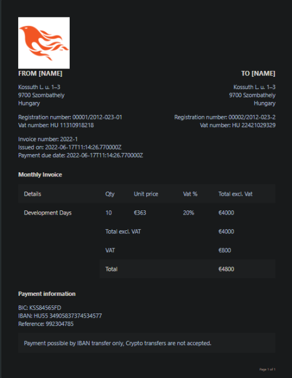
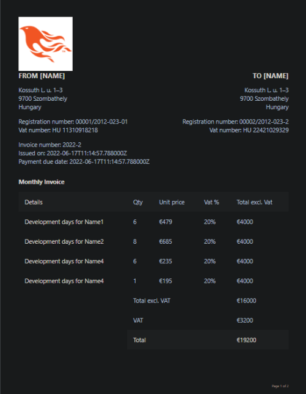
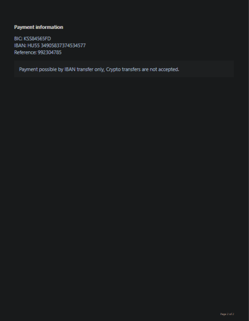
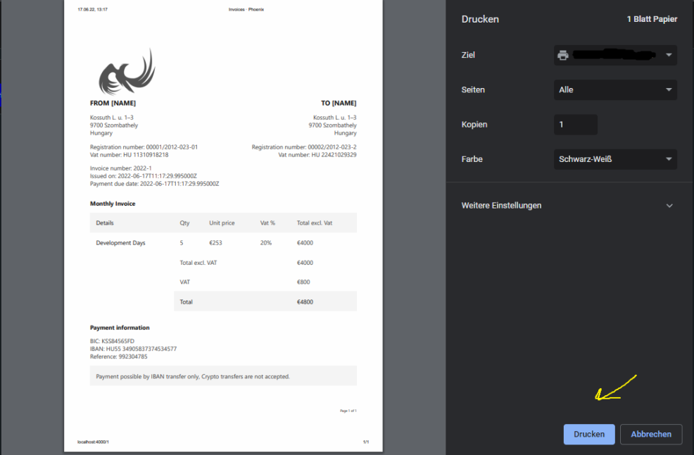

## 🧾 Phoenix Invoices

> ## 🙇🏻‍♂️ Why?
As a developer, you don't want to work with nasty PDFs or .docx files
Easily generate an invoice for your customers!

> ## 🙋🏻‍♂️ How?
```
$ git clone https://github.com/vKxni/invoices
```
```
$ cd invoices
```

```
$ mix deps.get
```
```
$ mix phx.server
```
Remember, you have to install [Elixir](https://elixir-lang.org/install.html) first ...
<hr>

## Faq
> Can I use this in production

You can, but I don't recommend it as it's a small example application. 

> How did you do that with the print feature?

Obviously with JavaScript, check out the assets folder or [click here](https://github.com/vKxni/invoices/blob/ca284fef9ccb6476262ba3ae2b9646f87c44d2af/assets/js/pdf.js#L11)

> How can I change the details/informations displayed in the documents?

You can directly edit the files [here](https://github.com/vKxni/invoices/blob/master/lib/billing.ex)


<hr>

## Examples

> Basic example (1)
<p align="left">
  <a href="https://discord.gg/3eNaWPhWZE" target="blank"></a>
</p>

> Detailed example (1/2)
<p align="left">
  <a href="https://discord.gg/3eNaWPhWZE" target="blank"></a>
</p>

> Detailed example (2/2)
<p align="left">
  <a href="https://discord.gg/3eNaWPhWZE" target="blank"></a>
</p>

> Print example
<p align="left">
  <a href="https://discord.gg/3eNaWPhWZE" target="blank"></a>
</p>

Have fun!
